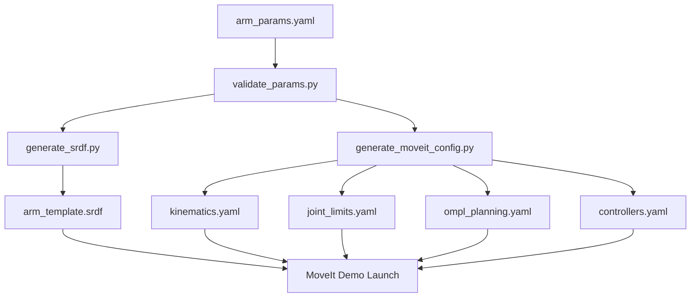

# URC Rover Parameter-Driven MoveIt Template System

A fully parameter-driven MoveIt template system for URC rover arms that can adapt to any 6-DOF arm configuration by simply editing a single YAML file.

## 🎯 Overview

This system provides a **plug-and-play** MoveIt stack for URC rover arm control that:

- **✅ Single Source of Truth**: All arm specifications defined in `arm_params.yaml`
- **✅ Auto-Generation**: URDF, SRDF, and MoveIt configs generated automatically
- **✅ Hardware Agnostic**: Works with any 6-DOF arm by changing parameters
- **✅ Mission Ready**: Pre-configured poses for all URC missions
- **✅ Safety First**: Built-in collision detection and safety limits
- **✅ Demo Ready**: Launches in RViz for immediate testing

## 📁 Package Structure

```
moveit/
├── arm_template/                    # Generic arm template package
│   ├── config/
│   │   ├── arm_params.yaml         # 🔥 SINGLE SOURCE OF TRUTH
│   │   ├── gripper_params.yaml
│   │   └── tool_params.yaml
│   ├── urdf/
│   │   ├── arm_template.urdf.xacro # Parameter-driven URDF
│   │   ├── gripper_template.urdf.xacro
│   │   └── tools/                  # URC mission tools
│   │       ├── wrench.urdf.xacro  
│   │       ├── probe.urdf.xacro   
│   │       └── scoop.urdf.xacro   
│   ├── scripts/
│   │   ├── generate_srdf.py        # Auto-generate SRDF
│   │   ├── generate_moveit_config.py
│   │   └── validate_params.py      # Parameter validation
│   └── launch/
│       ├── demo.launch.py          # Complete demo system
│       └── generate_configs.launch.py
├── moveit_config_template/         # Generated MoveIt config
│   ├── config/                     # Auto-generated configs
│   ├── srdf/                       # Auto-generated SRDF
│   ├── launch/
│   └── rviz/
└── README.md                       # This file
```

## 🚀 Quick Start

### 1. Configure Your Arm

Edit the single parameter file to match your arm:

```bash
# Edit the main configuration file
nano moveit/arm_template/config/arm_params.yaml
```

Key parameters to modify:
- **Joint limits**: Position, velocity, acceleration, effort limits
- **Link lengths**: Physical dimensions of your arm segments  
- **Masses & Inertias**: Physical properties for dynamics
- **Mission poses**: Predefined poses for URC tasks

### 2. Generate Configurations

Auto-generate all URDF, SRDF, and MoveIt configuration files:

```bash
# Validate parameters first
ros2 launch arm_template generate_configs.launch.py validate_only:=true

# Generate all configuration files
ros2 launch arm_template generate_configs.launch.py
```

### 3. Launch Demo

Start the complete system with RViz:

```bash
# Full demo with RViz
ros2 launch arm_template demo.launch.py

# Demo without RViz
ros2 launch arm_template demo.launch.py rviz:=false

# With real hardware
ros2 launch arm_template demo.launch.py use_fake_hardware:=false
```

## 📝 Parameter Configuration

### Core Arm Parameters

```yaml
arm:
  # Basic specifications
  name: "urc_arm"
  dof: 6
  joints: ["base_rotate", "shoulder_pitch", "shoulder_roll", 
           "elbow_pitch", "wrist_pitch", "wrist_roll"]
  
  # Physical dimensions (MODIFY FOR YOUR ARM)
  kinematics:
    base_height: 0.1           # Base link height
    upper_arm_length: 0.30     # Shoulder to elbow
    forearm_length: 0.25       # Elbow to wrist
    wrist_offset: 0.08         # Wrist joint offset
    tool_flange_length: 0.05   # Wrist to tool flange
  
  # Joint limits (MODIFY FOR YOUR ARM)
  joint_limits:
    position:
      base_rotate: [-3.14159, 3.14159]
      shoulder_pitch: [-1.5708, 1.5708]
      # ... etc for all joints
    velocity:
      base_rotate: 1.0
      # ... etc
    effort:
      base_rotate: 50.0
      # ... etc
```

### Mission-Specific Poses

Pre-configured poses for URC missions:

```yaml
mission_poses:
  # Equipment Servicing Mission
  es_ready: [0.0, -1.5708, 0.0, -1.5708, 0.0, 0.0]
  es_panel_approach: [0.0, -1.0, 0.0, -1.0, 0.0, 0.0]
  es_fine_position: [0.0, -0.8, 0.0, -0.8, 0.0, 0.0]
  
  # Science Mission
  sc_ready: [0.0, -1.5708, 0.0, -1.5708, 0.0, 0.0]
  sc_dig_position: [0.0, -1.0, 0.0, -1.0, 0.0, 0.0]
  sc_sample_collect: [0.0, -0.8, 0.0, -0.8, 0.0, 0.0]
  
  # Delivery Mission  
  dm_pickup_grasp: [0.0, -1.0, 0.0, -1.0, 0.0, 0.0]
  dm_transport: [0.0, -1.4, 0.0, -1.4, 0.0, 0.0]
  
  # Navigation
  stow: [0.0, -1.5708, 0.0, -1.5708, 0.0, 0.0]
```

## 🔧 Workflow: Parameter → Configuration

The system follows this automated workflow:



### Auto-Generation Process

1. **Validation**: Check parameter consistency and completeness
2. **URDF**: Parameter-driven URDF builds the robot model
3. **SRDF**: Auto-generate semantic robot description
4. **MoveIt Configs**: Generate all planning and control configurations
5. **Ready**: Launch complete MoveIt system

## 🛠 Advanced Usage

### Custom Tool Integration

Add mission-specific tools by modifying the tools section:

```yaml
tools:
  wrench:
    name: "wrench_tool"
    mass: 0.3
    size: [0.02, 0.02, 0.15]
    mount_offset: [0.0, 0.0, 0.075]
```

### Hardware Integration

Replace the mock hardware interface in the URDF:

```xml
<!-- Replace this -->
<plugin>mock_components/GenericSystem</plugin>

<!-- With your hardware interface -->
<plugin>your_hardware_package/YourHardwareInterface</plugin>
```

### Adding New Missions

1. Add poses to `mission_poses` in `arm_params.yaml`
2. Regenerate configurations: `ros2 launch arm_template generate_configs.launch.py`
3. Use poses in your mission code:
   ```python
   # In your mission node
   move_group.set_named_target("es_panel_approach")
   move_group.go()
   ```

## 🎮 Using the System

### RViz Motion Planning

After launching the demo:

1. **Planning Tab**: Use MoveIt motion planning plugin
2. **Named Poses**: Select from predefined URC mission poses
3. **Interactive Markers**: Drag end-effector to plan motions
4. **Collision Detection**: Built-in safety checks

### Programmatic Control

```python
import rclpy
from moveit_msgs.msg import MoveItErrorCodes
from moveit_msgs.srv import GetPositionIK
import moveit_commander

# Initialize MoveIt
moveit_commander.roscpp_initialize(sys.argv)
robot = moveit_commander.RobotCommander()
scene = moveit_commander.PlanningSceneInterface()
group = moveit_commander.MoveGroupCommander("arm")

# Use predefined poses
group.set_named_target("es_ready")
plan = group.go()

# Custom pose
pose_goal = geometry_msgs.msg.Pose()
pose_goal.orientation.w = 1.0
pose_goal.position.x = 0.4
pose_goal.position.y = 0.1
pose_goal.position.z = 0.4
group.set_pose_target(pose_goal)
plan = group.go()
```

## 🔒 Safety Features

- **Joint Limits**: Automatic enforcement of position, velocity, and effort limits
- **Collision Detection**: Self-collision and environment collision checking
- **Emergency Stop**: Integration with rover safety systems
- **Force Limits**: Configurable force/torque thresholds
- **Workspace Constraints**: Forbidden zones to avoid rover body collision

## 🚨 Troubleshooting

### Common Issues

1. **URDF Parsing Errors**
   ```bash
   # Check URDF syntax
   xacro moveit/arm_template/urdf/arm_template.urdf.xacro --check
   ```

2. **Parameter Validation Failures**
   ```bash
   # Run validation with detailed output
   python3 moveit/arm_template/scripts/validate_params.py --params config/arm_params.yaml
   ```

3. **MoveIt Planning Failures**
   - Check joint limits are reasonable
   - Verify kinematics solver timeout is sufficient
   - Ensure collision margins are appropriate

4. **RViz Visualization Issues**
   - Regenerate configurations after parameter changes
   - Check TF tree is publishing correctly

### Debug Commands

```bash
# Check robot state
ros2 topic echo /robot_description

# Monitor joint states  
ros2 topic echo /joint_states

# Check planning scene
ros2 topic echo /planning_scene

# MoveIt status
ros2 topic echo /move_group/status
```

## 🔄 Adapting to New Hardware

To adapt this template to a new arm:

1. **Measure Physical Parameters**
   - Joint limits (position, velocity, effort)
   - Link lengths and masses
   - Tool flange specifications

2. **Update `arm_params.yaml`**
   - Modify kinematic parameters
   - Adjust joint limits and safety parameters
   - Update controller gains if needed

3. **Generate and Test**
   ```bash
   # Validate new parameters
   ros2 launch arm_template generate_configs.launch.py validate_only:=true
   
   # Generate configurations
   ros2 launch arm_template generate_configs.launch.py
   
   # Test in simulation
   ros2 launch arm_template demo.launch.py
   ```

4. **Hardware Integration**
   - Replace mock hardware with actual driver
   - Tune controller parameters
   - Test safety systems

## 📚 Integration with URC Rover System

This MoveIt system integrates with the broader URC rover architecture:

```python
# In mission behavior trees
from arm_template_msgs.srv import MoveToNamedPose

# Equipment servicing sequence
self.move_to_pose("es_ready")
self.move_to_pose("es_panel_approach") 
self.move_to_pose("es_fine_position")
# Perform manipulation task
self.move_to_pose("stow")
```

## 🏆 URC Mission Readiness

This template provides everything needed for URC arm missions:

- **Equipment Servicing**: Fine positioning for panel operations
- **Science Mission**: Sample collection and analysis positioning  
- **Delivery Mission**: Object pickup and transport
- **Tool Changes**: Quick reconfiguration for different end-effectors

The parameter-driven approach means you can rapidly adapt to rule changes or hardware updates by simply editing configuration files rather than rewriting code.

---

**🎉 Your arm is now ready for URC competition!**
